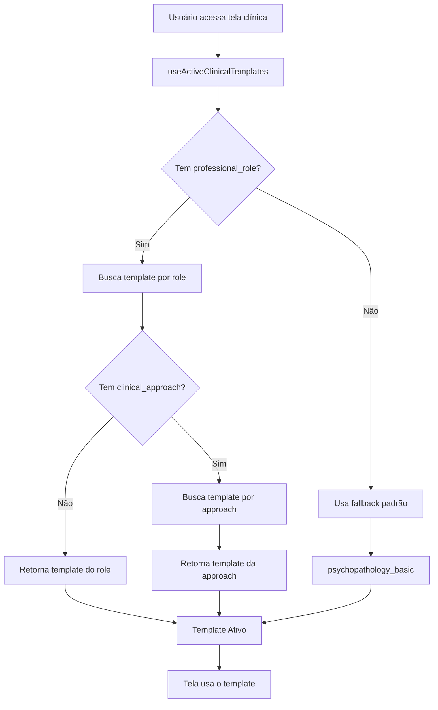
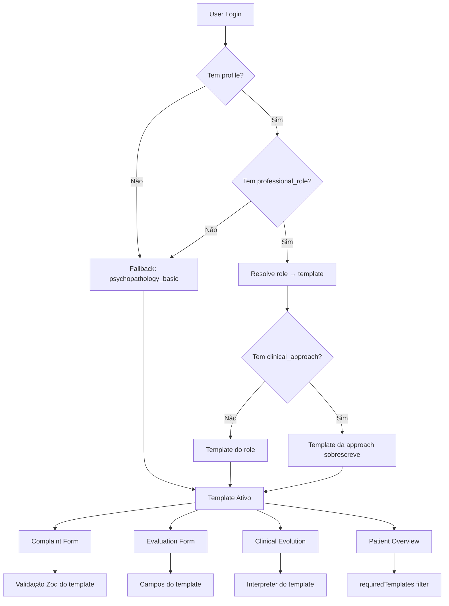

# 📚 CLINICAL TEMPLATES OVERVIEW

**Data:** 26/01/2025  
**TRACK:** C2 - Sistema de Templates Clínicos

---

## 📋 VISÃO GERAL

O Sistema de Templates Clínicos da MindWare permite que diferentes profissionais e abordagens clínicas tenham interfaces e validações customizadas para registro de dados.

### O que é um Clinical Template?

Um template clínico define:
- **Modelo de dados** (quais campos existem)
- **Validação** (regras Zod específicas)
- **Interpretação** (como transformar dados em resumos clínicos)
- **UI preferences** (quais cards aparecem, quais gráficos existem)

### Templates Disponíveis

Atualmente, existe **1 template** implementado:

| ID | Nome | Descrição | Profissões |
|----|------|-----------|------------|
| `psychopathology_basic` | Psicopatológico Básico | Avaliação completa de funções psíquicas baseada em exame psíquico clássico | Psicólogo, Psiquiatra |

**Templates futuros (planejados):**
- `tcc_template` - Template específico para TCC (pensamentos automáticos, registro cognitivo)
- `jungian_template` - Template junguiano (símbolos, arquétipos, sonhos)
- `neuropsychology_template` - Avaliação neuropsicológica

---

## 🗂️ ARQUITETURA DO SISTEMA

### Estrutura de Arquivos

```
src/lib/templates/
├── templateTypes.ts                    # Interfaces comuns de templates
├── templateRegistry.ts                 # Registry central de templates
├── templateService.ts                  # Serviço de resolução de templates
└── psychopathologyBasic/               # Template psicopatológico básico
    ├── index.ts                        # Entry point do template
    ├── complaintModel.ts               # Modelo de queixa clínica
    ├── sessionEvaluationModel.ts       # Modelo de avaliação de sessão
    ├── evolutionModel.ts               # Modelo de evolução (gráficos)
    ├── evolutionInterpreter.ts         # Interpretador de evolução
    └── fieldTypes.ts                   # Tipos de campos customizados
```

### Arquivos Principais

#### 1. `src/lib/templates/templateTypes.ts`

Define as interfaces principais:

```typescript
export interface ClinicalTemplate {
  id: string;
  label: string;
  description?: string;
  
  // Capabilities
  supportsComplaint: boolean;
  supportsSessionEvaluation: boolean;
  supportsEvolution: boolean;
  
  // Models
  complaintModel?: ComplaintModelConfig;
  sessionEvaluationModel?: SessionEvaluationModelConfig;
  evolutionModel?: EvolutionModelConfig;
  evolutionInterpreter?: ClinicalEvolutionInterpreter;
}
```

#### 2. `src/lib/templates/templateRegistry.ts`

Registry global de templates:

```typescript
export const CLINICAL_TEMPLATES: Record<string, ClinicalTemplate> = {
  psychopathology_basic: PSYCHOPATHOLOGY_BASIC_TEMPLATE,
  // Outros templates serão adicionados aqui
};
```

#### 3. `src/lib/templates/templateService.ts`

Serviço de resolução de templates com base em:
- `professional_role_id` do usuário (ex: psicólogo → `psychology_basic`)
- `clinical_approach_id` do usuário (ex: TCC → `tcc_template`)

```typescript
export async function getActiveClinicalTemplatesForUser(
  userId: string
): Promise<ActiveTemplatesResult>;
```

---

## 🔄 FLUXO DE USO

### Como o sistema resolve qual template usar?



### Mapeamento Role → Template

Definido em `src/lib/templates/templateService.ts`:

```typescript
const ROLE_TEMPLATE_MAP: Record<string, string> = {
  'psychology_basic': 'psychopathology_basic',
  'psychiatry_basic': 'psychopathology_basic',
};
```

### Mapeamento Approach → Template (futuro)

```typescript
const APPROACH_TEMPLATE_MAP: Record<string, string> = {
  'tcc': 'tcc_template',          // TCC tem seu próprio template
  'junguiana': 'jungian_template', // Junguiana tem seu próprio template
};
```

---

## 🎯 USO POR TELA

### 1. Clinical Complaint Form

**Arquivo:** `src/pages/ClinicalComplaintForm.tsx`

**Usa:** `complaintModel` do template

```tsx
import { useActiveClinicalTemplates } from '@/hooks/useActiveClinicalTemplates';

const { activeRoleTemplate, isLoading } = useActiveClinicalTemplates();

if (!activeRoleTemplate?.supportsComplaint) {
  return <Alert>Template não suporta queixas clínicas</Alert>;
}

// Usar template para validação, campos, etc.
```

**O que o template define:**
- Quais campos aparecem no formulário
- Validação Zod customizada
- Helpers de formatação

### 2. Session Evaluation Form

**Arquivo:** `src/pages/SessionEvaluationForm.tsx`

**Usa:** `sessionEvaluationModel` do template

```tsx
const { activeRoleTemplate } = useActiveClinicalTemplates();

if (!activeRoleTemplate?.supportsSessionEvaluation) {
  return <Alert>Template não suporta avaliação de sessão</Alert>;
}

// Usar campos do template
const fields = activeRoleTemplate.sessionEvaluationModel.fields;
```

**O que o template define:**
- 12 funções psíquicas (ou diferentes, dependendo do template)
- Ranges de valores (bipolar, unipolar, etc.)
- Valores default
- Validação Zod

### 3. Clinical Evolution

**Arquivo:** `src/components/ClinicalEvolution.tsx`

**Usa:** `evolutionModel` + `evolutionInterpreter` do template

```tsx
const { activeRoleTemplate } = useActiveClinicalTemplates();

// Interpretação
const summary = activeRoleTemplate.evolutionInterpreter.generateGlobalSummary(evaluation);

// Gráficos
const charts = activeRoleTemplate.evolutionModel.charts;
```

**O que o template define:**
- Como interpretar avaliações (texto de resumo)
- Severidades (normal/moderate/severe)
- Quais gráficos existem
- Configuração dos gráficos (tipo, campos, eixos)

### 4. Patient Overview

**Arquivo:** `src/pages/PatientDetail.tsx`

**Usa:** `requiredTemplates` dos cards

```tsx
import { useCardPermissions } from '@/hooks/useCardPermissions';

const { canViewCard } = useCardPermissions();

// Apenas cards compatíveis com o template ativo são exibidos
```

**O que o template define:**
- Quais cards aparecem (via `requiredTemplates`)
- Compatibilidade de domínios

---

## 🛠️ COMO CRIAR UM NOVO TEMPLATE

### Passo 1: Copiar estrutura base

```bash
# Copiar template psicopatológico como base
cp -r src/lib/templates/psychopathologyBasic src/lib/templates/meuNovoTemplate
```

### Passo 2: Ajustar modelos

**Editar:** `src/lib/templates/meuNovoTemplate/index.ts`

```typescript
export const MEU_NOVO_TEMPLATE: ClinicalTemplate = {
  id: 'meu_novo_template',
  label: 'Meu Novo Template',
  description: 'Template customizado para...',
  
  supportsComplaint: true,
  supportsSessionEvaluation: true,
  supportsEvolution: true,
  
  complaintModel: MY_COMPLAINT_MODEL_CONFIG,
  sessionEvaluationModel: MY_EVALUATION_MODEL_CONFIG,
  evolutionModel: MY_EVOLUTION_MODEL_CONFIG,
  evolutionInterpreter: MyEvolutionInterpreter,
};
```

### Passo 3: Registrar no registry

**Editar:** `src/lib/templates/templateRegistry.ts`

```typescript
import { MEU_NOVO_TEMPLATE } from './meuNovoTemplate';

export const CLINICAL_TEMPLATES: Record<string, ClinicalTemplate> = {
  psychopathology_basic: PSYCHOPATHOLOGY_BASIC_TEMPLATE,
  meu_novo_template: MEU_NOVO_TEMPLATE, // ✅ NOVO
};
```

### Passo 4: Mapear role/approach

**Editar:** `src/lib/templates/templateService.ts`

```typescript
const APPROACH_TEMPLATE_MAP: Record<string, string> = {
  'minha_abordagem': 'meu_novo_template', // ✅ NOVO
};
```

### Passo 5: Configurar requiredTemplates nos cards

**Editar:** `src/lib/patientOverviewCardRegistry.tsx`

Para cards que devem aparecer APENAS com o novo template:

```tsx
{
  id: 'meu-card-especial',
  domain: 'clinical',
  requiredTemplates: ['meu_novo_template'], // ✅ Só aparece com este template
  // ...
}
```

---

## 🧪 COMO RODAR TESTES DE TEMPLATES

### No Browser Console

Abra a aplicação e execute no console:

```javascript
// Importar função (já está no window)
runAllTemplateTests();
```

Ou, para testes individuais:

```javascript
// Teste do template psicopatológico
import { runClinicalComplaintFormTests } from '@/lib/clinical/tests/complaintFormTests';
runClinicalComplaintFormTests();

// Teste de evolução
import { runClinicalEvolutionTemplateTests } from '@/lib/clinical/tests/clinicalEvolutionTemplateTests';
runClinicalEvolutionTemplateTests();
```

### Arquivos de Teste

| Arquivo | O que testa |
|---------|-------------|
| `complaintFormTests.ts` | Validação de queixa clínica |
| `sessionEvaluationFormTests.ts` | Estrutura de avaliação de sessão |
| `sessionEvaluationTemplateTests.ts` | Integração de template em avaliação |
| `clinicalEvolutionTemplateTests.ts` | Interpretação de evolução |
| `patientOverviewTemplateTests.ts` | Compatibilidade de cards |
| `runAllTemplateTests.ts` | **Runner unificado** |

---

## 🔒 SEGURANÇA E RLS

### Dados persistidos

Os dados de queixas, avaliações e evoluções são salvos em **JSONB**, independente do template.

**Vantagem:**
- Flexibilidade: diferentes templates podem coexistir no mesmo banco
- Não quebra dados antigos ao adicionar novos templates

**Desvantagem:**
- Validação acontece apenas no frontend (Zod)
- RLS protege acesso, mas não valida estrutura interna do JSONB

### RLS Policies

Todas as tabelas clínicas têm RLS:
- `clinical_complaints` → RLS por `organization_id`
- `session_evaluations` → RLS por `organization_id`
- `patient_overview_layouts` → RLS por `user_id`

Templates **não mudam** RLS, apenas definem UI/validação.

---

## 📊 FLUXOGRAMA COMPLETO



---

## 🚀 PRÓXIMOS PASSOS (ROADMAP)

### Templates Futuros

1. **TCC Template** (`tcc_template`)
   - Campos: pensamentos automáticos, crenças intermediárias, esquemas
   - Registros cognitivos
   - Gráficos de evolução de pensamentos disfuncionais

2. **Jungian Template** (`jungian_template`)
   - Campos: símbolos, arquétipos, sonhos
   - Interpretação de símbolos
   - Análise de individuação

3. **Neuropsychology Template** (`neuropsychology_template`)
   - Testes neuropsicológicos
   - Perfil cognitivo
   - Reabilitação cognitiva

### Melhorias Futuras

- [ ] Template editor visual (criar templates sem code)
- [ ] Exportar/importar templates (JSON)
- [ ] Versionamento de templates (v1, v2, etc.)
- [ ] A/B testing de templates
- [ ] Analytics de uso por template

---

## 📞 CONTATO E SUPORTE

Para dúvidas sobre o sistema de templates, consultar:
- **Desenvolvedor:** Ver histórico de commits da TRACK C2
- **Documentação:** Esta overview + relatórios de cada fase C2.x
- **Testes:** `runAllTemplateTests()` no console

**Data do documento:** 26/01/2025  
**Última atualização:** FASE C2.8 (Polimento Final)
