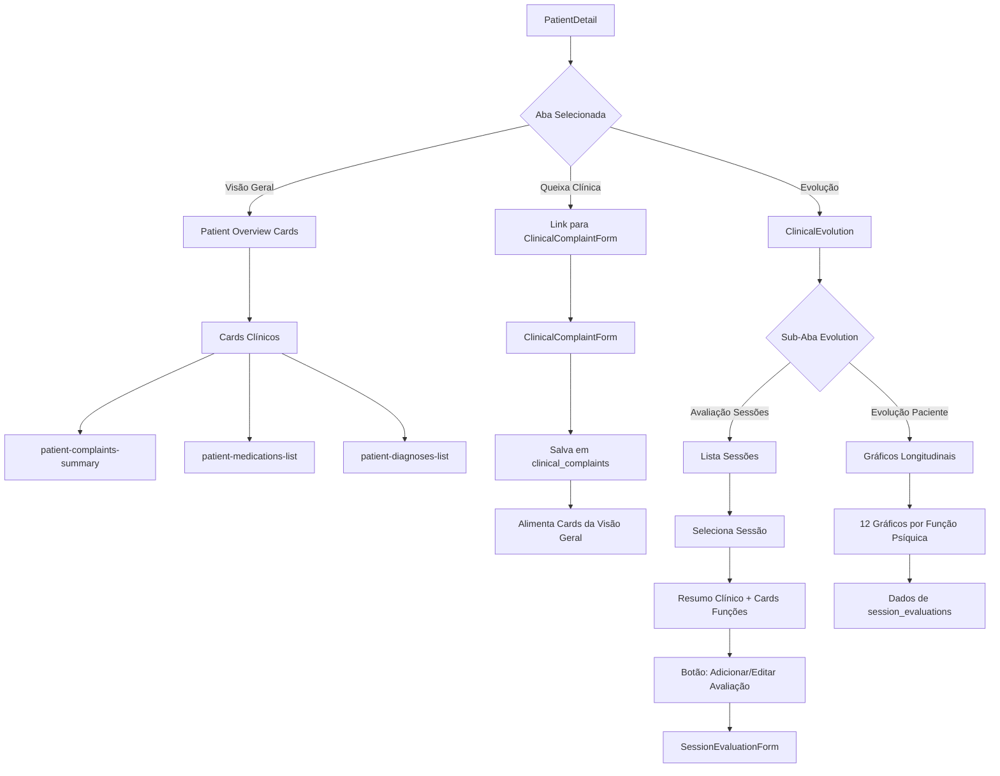

# 📋 FASE C2.0 – AUDITORIA COMPLETA DO SISTEMA DE PATIENT EVOLUTION

**Data**: 2025-01-26  
**Auditor**: Lovable AI  
**Escopo**: Sistema de evolução clínica do paciente (Queixa, Avaliação de Sessão, Evolução)

---

## 📌 SUMÁRIO EXECUTIVO

### ✅ O QUE ESTÁ SÓLIDO

1. **Arquitetura Multi-tenant**: RLS e `organization_id` bem implementados em todas as tabelas clínicas
2. **Sistema de Permissões**: Framework robusto com `resolveEffectivePermissions` → `useCardPermissions` → metadados de cards
3. **Domains Consolidados**: Tripé `clinical | financial | administrative` bem definido e respeitado
4. **Visão Geral (C1)**: Sistema de cards com layout customizável via Supabase funcionando perfeitamente
5. **Queixa Ativa Única**: Lógica de `is_active` consolidada e usada consistentemente
6. **Dados Estruturados**: Modelagem de `clinical_complaints`, `session_evaluations` bem normalizada

### ⚠️ ONDE DÓI HOJE

1. **Template Hardcoded**: Todo código assume "psicólogo psicopatológico" - não há camada de abstração
2. **SessionEvaluationForm**: 850+ linhas com toda lógica de funções psíquicas hardcoded
3. **ClinicalComplaintForm**: Lógica de desativação de queixas antigas **NÃO IMPLEMENTADA**
4. **ClinicalEvolution**: Funções de geração de texto (`generateSummary`, `getConsciousnessSummary`) com interpretações clínicas fixas
5. **Ausência de Templates no Frontend**: `professional_roles` e `clinical_approaches` existem no banco mas **não são lidos nem usados**
6. **Layout Evolution em localStorage**: Não persiste no Supabase (diferente de Dashboard/Overview)
7. **Dependências Implícitas**: Muitos componentes assumem estruturas JSON específicas sem validação

### 🎯 ONDE C2 PODE ATUAR COM MAIS IMPACTO

1. **Criar Template Service/Hook**: Ler `professional_roles` + `clinical_approaches` do usuário
2. **Formalizar Template Psicopatológico Básico**: Extrair configurações hardcoded para estrutura declarativa
3. **Refatorar ClinicalComplaintForm**: 
   - Implementar desativação automática de queixas antigas
   - Preparar para múltiplos templates
4. **Refatorar SessionEvaluationForm**: Componentizar funções psíquicas para permitir templates diferentes
5. **Adaptar ClinicalEvolution**: Tornar geradores de texto configuráveis por template
6. **Metadados nos Cards Clínicos**: Adicionar `requiredTemplates` no registry

---

## 1. FLUXO DE DADOS – VISÃO MACRO

### 1.1. Do Ponto de Vista do Paciente

#### **Queixa Clínica Ativa**

```
clinical_complaints
├── is_active: boolean (flag de queixa ativa)
├── patient_id (FK)
├── organization_id (RLS)
├── cid_code, cid_title, cid_group
├── severity, functional_impairment, suicidality, aggressiveness
├── onset_type, onset_duration_weeks, course
├── clinical_notes
└── relationships:
    ├── complaint_medications (FK complaint_id)
    ├── complaint_symptoms (FK complaint_id)
    └── complaint_specifiers (FK complaint_id)
```

**Fluxo**:
1. Profissional acessa `ClinicalComplaintForm` via `/patients/:patientId/complaint/new` ou `/edit`
2. Preenche dados diagnósticos (CID, sintomas, meds, caracterização clínica)
3. Marca como ativa (`is_active: true`)
4. **PROBLEMA IDENTIFICADO**: Não há lógica de desativação de queixas antigas no frontend
5. Queixa ativa é consumida por:
   - **PatientDetail** → carrega via query `is_active = true` + relationships
   - **Cards Clínicos da Visão Geral** (`patient-complaints-summary`, `patient-medications-list`, `patient-diagnoses-list`)

#### **Avaliação de Sessão (Exame Mental)**

```
session_evaluations
├── session_id (FK sessions)
├── patient_id
├── evaluated_by
├── organization_id (RLS)
└── 12 campos jsonb (funções psíquicas):
    ├── consciousness_data
    ├── attention_data
    ├── sensoperception_data
    ├── memory_data
    ├── thought_data
    ├── language_data
    ├── mood_data
    ├── will_data
    ├── psychomotor_data
    ├── orientation_data
    ├── intelligence_data
    └── personality_data
```

**Fluxo**:
1. Profissional acessa `SessionEvaluationForm` via botão em `ClinicalEvolution` ou link direto `/patients/:patientId/sessions/:sessionId/evaluation`
2. Preenche **12 blocos** de funções psíquicas (cada um com múltiplos campos - escalas, flags, textos)
3. Salva em `session_evaluations` (upsert por `session_id`)
4. Dados são consumidos por:
   - **ClinicalEvolution (Aba Sessões)**: Resumo clínico textual + cards de funções
   - **ClinicalEvolution (Aba Evolução)**: Gráficos longitudinais (série temporal)

#### **Evolução Clínica (ClinicalEvolution)**

Componente com **2 abas internas** (Tabs):

**Aba 1: Avaliação de Sessões**
- **Sidebar esquerda**: Lista de sessões (`status = 'attended'`) com badges de avaliação/notas/arquivos
- **Painel direito**: 
  - Se sessão selecionada **tem** evaluation → Resumo clínico + 12 cards de funções + anotações + upload de arquivos
  - Se sessão selecionada **não tem** evaluation → Placeholder + botão para criar

**Aba 2: Evolução do Paciente**
- Carrega série temporal de `session_evaluations` (join com `sessions` para datas)
- Gera **12 gráficos** (Line, Pie, Radar) para evolução de cada função psíquica
- Filtro de período (all / last_month / last_3_months / last_year)
- Layout customizável via `localStorage` (visibilidade de gráficos, resize)

### 1.2. Do Ponto de Vista do Usuário (Profissional)

#### **Jornada de Uso**



#### **Navegação e Links**

1. **PatientDetail** (`/patients/:patientId`)
   - Aba "Visão Geral" → Cards clínicos (queixa, meds, dx)
   - Aba "Queixa Clínica" → Link para `ClinicalComplaintForm`
   - Aba "Evolução" → Renderiza `ClinicalEvolution`

2. **ClinicalComplaintForm** (`/patients/:patientId/complaint/new` ou `/:complaintId/edit`)
   - Standalone page
   - Botão "Cancelar" → volta para PatientDetail
   - Botão "Salvar" → persiste e volta para PatientDetail

3. **SessionEvaluationForm** (`/patients/:patientId/sessions/:sessionId/evaluation`)
   - Standalone page
   - Acesso via botões em `ClinicalEvolution`
   - Botão "Cancelar" → volta para ClinicalEvolution
   - Botão "Salvar" → persiste e volta para ClinicalEvolution

4. **ClinicalEvolution** (componente dentro de PatientDetail)
   - Aba interna "Avaliação de Sessões"
   - Aba interna "Evolução do Paciente"
   - Persiste sub-aba ativa em `sessionStorage.returnToSubTab`

---

## 2. QUEIXA CLÍNICA – ANÁLISE DETALHADA

### 2.1. Modelagem e RLS

#### **Tabela `clinical_complaints`**

```sql
clinical_complaints (
  id uuid PRIMARY KEY,
  patient_id uuid NOT NULL,
  organization_id uuid,
  created_by uuid NOT NULL,
  is_active boolean DEFAULT true,
  
  -- Diagnóstico CID
  cid_code text,
  cid_title text,
  cid_group text,
  has_no_diagnosis boolean,
  
  -- Caracterização Clínica
  severity text,  -- leve | moderado | grave | psicótico
  functional_impairment text,  -- nenhum | leve | moderado | grave
  onset_type text,  -- agudo | insidioso | gradual
  onset_duration_weeks integer,
  course text,  -- episódico | contínuo | recorrente
  
  -- Avaliação de Risco
  suicidality text,  -- nenhum | ideação | plano | tentativa
  aggressiveness text,  -- nenhum | verbal | física
  
  -- Outros
  clinical_notes text,
  comorbidities jsonb,
  vulnerabilities text[],
  reported_by text,
  
  created_at timestamptz,
  updated_at timestamptz
)
```

#### **RLS Policies (FASE 11.1)**

```sql
-- Admin: acesso total
clinical_complaints_admin_all (ALL)
WHERE has_role(auth.uid(), 'admin')

-- Organização: SELECT
clinical_complaints_org_select (SELECT)
WHERE organization_id = current_user_organization()

-- Owner: INSERT/UPDATE/DELETE
clinical_complaints_org_insert (INSERT)
WHERE organization_id = current_user_organization()

clinical_complaints_org_update (UPDATE)
WHERE organization_id = current_user_organization()

clinical_complaints_org_delete (DELETE)
WHERE organization_id = current_user_organization()
```

**✅ RLS Status**: **BEM CONFIGURADO**
- Isolamento por `organization_id`
- Trigger `set_organization_id_from_patient_on_complaint` garante preenchimento automático
- Admin tem override completo

#### **Tabelas Auxiliares**

**`complaint_medications`**
```sql
complaint_medications (
  id uuid,
  complaint_id uuid FK,
  organization_id uuid,
  class text NOT NULL,
  substance text,
  dosage text,
  frequency text,
  start_date date,
  end_date date,
  is_current boolean DEFAULT true,
  adverse_effects text,
  notes text
)
```

**`complaint_symptoms`**
```sql
complaint_symptoms (
  id uuid,
  complaint_id uuid FK,
  organization_id uuid,
  symptom_label text NOT NULL,
  category text,
  intensity integer,  -- 1-5
  frequency text,
  is_present boolean DEFAULT true,
  notes text
)
```

**`complaint_specifiers`**
```sql
complaint_specifiers (
  id uuid,
  complaint_id uuid FK,
  organization_id uuid,
  specifier_type text NOT NULL,
  specifier_value text NOT NULL
)
```

**✅ RLS Status**: **TODAS COM RLS** (mesmo padrão org_select/insert/update/delete)

### 2.2. ClinicalComplaintForm.tsx – Análise Detalhada

**Localização**: `src/pages/ClinicalComplaintForm.tsx`  
**Tamanho**: ~758 linhas  
**Estado**: Funcional mas com **PROBLEMA CRÍTICO** identificado

#### **Estrutura**

```typescript
// State Management
const [patient, setPatient] = useState()
const [cidOptions, setCidOptions] = useState([])
const [selectedCid, setSelectedCid] = useState()
const [symptoms, setSymptoms] = useState([])
const [medications, setMedications] = useState([])
const [medicationCatalog, setMedicationCatalog] = useState([])
const [clinicalData, setClinicalData] = useState({
  severity, functional_impairment, onset_type, onset_duration_weeks, course,
  suicidality, aggressiveness, clinical_notes, has_no_diagnosis
})

// useEffect Hooks
useEffect(() => loadPatient(), [patientId])
useEffect(() => searchCID(), [cidSearchTerm])
useEffect(() => loadSymptoms(), [selectedCid])
useEffect(() => loadMedicationCatalog(), [])
useEffect(() => loadComplaint(), [complaintId])  // Se editando
```

#### **Fluxo de Criação/Edição**

**Criação Nova Queixa**:
```typescript
1. User acessa /patients/:patientId/complaint/new
2. Form carrega paciente + catálogo de medicamentos
3. User busca CID → query em cid_catalog
4. Ao selecionar CID → carrega symptom pack (cid_symptom_packs)
5. User preenche:
   - Sintomas (checkboxes + sliders de intensidade)
   - Caracterização clínica (dropdowns)
   - Risco (suicidalidade, agressividade)
   - Medicações (adicionar múltiplas)
   - Notas clínicas
6. handleSubmit():
   - getCurrentUser()
   - INSERT em clinical_complaints com is_active: true
   - DELETE sintomas/meds anteriores (se editando)
   - INSERT novos sintomas (complaint_symptoms)
   - INSERT novas meds (complaint_medications)
   - toast.success + navigate de volta
```

**Edição de Queixa Existente**:
```typescript
1. User acessa /patients/:patientId/complaint/:complaintId/edit
2. loadComplaint():
   - SELECT complaint com relationships
   - Popula todos os campos do form
3. Mesma lógica de submit, mas com UPDATE ao invés de INSERT
```

#### **🚨 PROBLEMA CRÍTICO IDENTIFICADO**

**Linha ~330 do handleSubmit**:
```typescript
const { data: complaint, error: complaintError } = complaintId
  ? await supabase
      .from('clinical_complaints')
      .update({
        cid_code: selectedCid?.code || null,
        // ... outros campos
        is_active: true,  // ❌ SEMPRE marca como ativa
        updated_at: new Date().toISOString(),
      })
      .eq('id', complaintId)
      .select()
      .single()
  : await supabase
      .from('clinical_complaints')
      .insert({
        patient_id: patientId,
        created_by: currentUser.id,
        // ... outros campos
        is_active: true,  // ❌ SEMPRE marca como ativa
      })
      .select()
      .single();
```

**O que está faltando**:
```typescript
// ❌ NÃO IMPLEMENTADO: Desativar queixas antigas antes de criar nova
if (!complaintId) {  // Se criando nova
  await supabase
    .from('clinical_complaints')
    .update({ is_active: false })
    .eq('patient_id', patientId)
    .eq('is_active', true)
    .neq('id', complaint.id);  // Excluir a nova
}
```

**Consequência**:
- Possibilidade de **múltiplas queixas ativas** para o mesmo paciente
- Viola semântica de "queixa ativa única"
- Cards da Visão Geral podem mostrar dados inconsistentes

#### **Outros Pontos Frágeis**

1. **Validação**:
   - Não há validação de campos obrigatórios (exceto toasts genéricos)
   - Permite salvar queixa sem CID e sem marcar `has_no_diagnosis`

2. **UX**:
   - Busca de CID é por input livre (sem debounce implementado visualmente)
   - Adição de medicações é manual (poderia ter autocomplete melhor)

3. **Acoplamento com Template Psicopatológico**:
   - Toda estrutura de sintomas assume `cid_symptom_packs`
   - Não há camada de abstração para templates futuros
   - Campos de caracterização clínica são hardcoded (severity, course, etc.)

### 2.3. Integração com PatientDetail / Visão Geral

#### **Como a Queixa Ativa é Carregada**

**PatientDetail.tsx (~linha 80)**:
```typescript
const { data: complaint } = await supabase
  .from('clinical_complaints')
  .select(`
    *,
    complaint_medications!inner(*),
    complaint_symptoms!inner(*),
    complaint_specifiers(*)
  `)
  .eq('patient_id', id)
  .eq('is_active', true)
  .order('created_at', { ascending: false })
  .limit(1)
  .maybeSingle();
```

**✅ Lógica Correta**:
- Query com `is_active = true`
- Relationships populados (`!inner` garante join)
- Ordenação por `created_at DESC` + `limit(1)` como fallback de segurança

#### **Cards Clínicos que Dependem da Queixa**

**`patientOverviewCardRegistry.tsx`**:

1. **`patient-complaints-summary`** (id: `patient-complaints-summary`)
   - Mostra: CID, gravidade, notas clínicas
   - Props: `complaint` (objeto único, não array)
   - Domain: `clinical`

2. **`patient-medications-list`** (id: `patient-medications-list`)
   - Mostra: `complaint.complaint_medications` filtrado por `is_current: true`
   - Props: `complaint`
   - Domain: `clinical`

3. **`patient-diagnoses-list`** (id: `patient-diagnoses-list`)
   - Mostra: `complaint.cid_code` + `complaint.cid_title`
   - Props: `complaint`
   - Domain: `clinical`

**✅ Integração Sólida**:
- Cards recebem `complaint` como prop única (não array)
- Tratam corretamente casos de `complaint === null`
- Respeitam domain `clinical` para permissões

#### **Acoplamento Escondido**

**ClinicalComplaintSummary.tsx** (componente adicional):
- Também carrega queixa ativa via query similar
- Usado em outras telas (não apenas PatientDetail)
- Duplica lógica de carregamento (poderia ser hook compartilhado)

---

## 3. AVALIAÇÃO DE SESSÃO (SessionEvaluationForm) – ANÁLISE DETALHADA

### 3.1. Modelagem de `session_evaluations`

```sql
session_evaluations (
  id uuid PRIMARY KEY,
  session_id uuid NOT NULL UNIQUE,  -- 1:1 com sessions
  patient_id uuid NOT NULL,
  evaluated_by uuid NOT NULL,
  organization_id uuid,
  
  -- 12 blocos JSONB (funções psíquicas)
  consciousness_data jsonb DEFAULT {...},
  attention_data jsonb DEFAULT {...},
  sensoperception_data jsonb DEFAULT {...},
  memory_data jsonb DEFAULT {...},
  thought_data jsonb DEFAULT {...},
  language_data jsonb DEFAULT {...},
  mood_data jsonb DEFAULT {...},
  will_data jsonb DEFAULT {...},
  psychomotor_data jsonb DEFAULT {...},
  orientation_data jsonb DEFAULT {...},
  intelligence_data jsonb DEFAULT {...},
  personality_data jsonb DEFAULT {...},
  
  created_at timestamptz,
  updated_at timestamptz
)
```

#### **Estrutura dos JSONBs**

**Exemplo: `consciousness_data`**
```json
{
  "level": 0,         // Escala bipolar -100 a +100
  "field": 0,         // Escala bipolar -100 a +100
  "notes": "",
  "oriented_auto": false,
  "derealization": false,
  "depersonalization": false,
  "disoriented_time": false,
  "disoriented_space": false,
  "self_consciousness": 0  // Escala unipolar 0-100
}
```

**Exemplo: `mood_data`**
```json
{
  "polarity": 0,  // Bipolar -100 (depressivo) a +100 (maníaco)
  "lability": 50,  // Unipolar 0-100
  "adequacy": "adequate",  // Enum
  "emotional_responsiveness": true,
  "notes": ""
}
```

**Padrões Identificados**:
- **Escalas Bipolares**: -100 a +100 (humor, pensamento, consciência)
- **Escalas Unipolares**: 0 a 100 (atenção, memória, orientação)
- **Flags Booleanas**: Para sintomas específicos (derealization, amnesia, etc.)
- **Enums**: Para categorizações (adequacy, articulation, etc.)

#### **RLS (FASE 11.1)**

```sql
-- Admin: acesso total
session_evaluations_admin_all (ALL)

-- Organização: SELECT/INSERT/UPDATE/DELETE
session_evaluations_org_select (SELECT)
WHERE organization_id = current_user_organization()

session_evaluations_org_insert (INSERT)
WHERE organization_id = current_user_organization()

session_evaluations_org_update (UPDATE)
WHERE organization_id = current_user_organization()

session_evaluations_org_delete (DELETE)
WHERE organization_id = current_user_organization()
```

**✅ RLS Status**: **BEM CONFIGURADO**

### 3.2. SessionEvaluationForm.tsx – Análise Detalhada

**Localização**: `src/pages/SessionEvaluationForm.tsx`  
**Tamanho**: **~850 linhas** (componente mais complexo do sistema clínico)  
**Estado**: Funcional mas **EXTREMAMENTE HARDCODED**

#### **Estrutura Macro**

```typescript
// State (1 state por função psíquica = 12 states)
const [consciousnessData, setConsciousnessData] = useState(defaults)
const [attentionData, setAttentionData] = useState(defaults)
const [sensoperceptionData, setSensoperceptionData] = useState(defaults)
const [memoryData, setMemoryData] = useState(defaults)
const [thoughtData, setThoughtData] = useState(defaults)
const [languageData, setLanguageData] = useState(defaults)
const [moodData, setMoodData] = useState(defaults)
const [willData, setWillData] = useState(defaults)
const [psychomotorData, setPsychomotorData] = useState(defaults)
const [orientationData, setOrientationData] = useState(defaults)
const [intelligenceData, setIntelligenceData] = useState(defaults)
const [personalityData, setPersonalityData] = useState(defaults)

// Carregamento
useEffect(() => {
  loadSession();
  loadEvaluation();  // Se já existe, popula states
}, [sessionId]);

// Persistência
const handleSave = async () => {
  const evaluationData = {
    session_id: sessionId,
    patient_id: session.patient_id,
    evaluated_by: user.id,
    consciousness_data: consciousnessData,
    attention_data: attentionData,
    // ... todos os 12 campos
  };
  
  await supabase
    .from('session_evaluations')
    .upsert(evaluationData, { onConflict: 'session_id' });
};
```

#### **Renderização (12 Seções de Accordion)**

```tsx
<Accordion type="multiple">
  {/* 1. CONSCIÊNCIA */}
  <AccordionItem value="consciousness">
    <AccordionTrigger>Consciência</AccordionTrigger>
    <AccordionContent>
      {/* Nível (slider bipolar) */}
      <Label>Nível (-100 = torpor, +100 = hipervigilância)</Label>
      <Slider 
        value={[consciousnessData.level]}
        onChange={(v) => setConsciousnessData({...consciousnessData, level: v[0]})}
        min={-100} max={100}
      />
      
      {/* Campo (slider bipolar) */}
      <Label>Campo (-100 = estreitado, +100 = ampliado)</Label>
      <Slider ... />
      
      {/* Checkboxes para sintomas */}
      <Checkbox checked={consciousnessData.derealization} ... />
      <Checkbox checked={consciousnessData.depersonalization} ... />
      
      {/* Notas */}
      <Textarea value={consciousnessData.notes} ... />
    </AccordionContent>
  </AccordionItem>
  
  {/* 2. ORIENTAÇÃO */}
  <AccordionItem value="orientation">
    ...
  </AccordionItem>
  
  {/* ... 10 mais (ATENÇÃO, SENSOPERCEPÇÃO, MEMÓRIA, etc.) */}
</Accordion>
```

#### **🚨 PROBLEMAS IDENTIFICADOS**

**1. Repetição Massiva**:
- Cada função psíquica tem seu próprio state + setter
- Lógica de renderização copiada 12 vezes com variações mínimas
- Sem componentização (deveria ter `<PsychicFunctionInput />` genérico)

**2. Acoplamento Total com Template Psicopatológico**:
- Todas as 12 funções são hardcoded
- Escalas, labels, interpretações assumem modelo psiquiátrico
- Impossível adaptar para outros roles (nutri, fono) sem reescrever tudo

**3. Validação Ausente**:
- Não há validação de campos obrigatórios
- Permite salvar avaliação vazia
- Não valida ranges de escalas

**4. Defaults Complexos**:
- Cada JSONB tem um default extenso duplicado em vários lugares
- Deveria vir de um único arquivo de configuração

**5. UX de Navegação**:
- Form muito longo (scroll infinito)
- Accordion ajuda mas ainda é cansativo
- Poderia ter tabs ou wizard multi-step

#### **Pontos Positivos**

✅ **Persistência Robusta**: Upsert por `session_id` evita duplicatas  
✅ **Volta para Contexto Correto**: Usa `sessionStorage.returnToSubTab` para voltar à aba certa de Evolution  
✅ **RLS Respeitado**: `organization_id` preenchido via trigger

### 3.3. Dependências e Assumições

**Campos Assumidos como Obrigatórios** (sem validação explícita):
- `consciousness_data.level`
- `orientation_data.time/space/person`
- `mood_data.polarity`
- `thought_data.course`

**Riscos**:
- Se algum campo for `undefined` → gráficos de Evolution podem quebrar
- Funções de geração de texto (`generateSummary`) assumem campos existem

---

## 4. CLINICALEVOLUTION.TSX – ANÁLISE DETALHADA

**Localização**: `src/components/ClinicalEvolution.tsx`  
**Tamanho**: ~1200 linhas (um dos maiores componentes do sistema)  
**Estado**: Funcional mas **FORTEMENTE ACOPLADO** ao template psicopatológico

### 4.1. Aba "Avaliação de Sessões"

#### **Estrutura**

```typescript
// State
const [sessions, setSessions] = useState([])
const [selectedSession, setSelectedSession] = useState(null)
const [evaluation, setEvaluation] = useState(null)
const [period, setPeriod] = useState('all')

// Carregamento de Sessões
useEffect(() => {
  loadSessions();
}, [patientId, period]);

const loadSessions = async () => {
  let query = supabase
    .from('sessions')
    .select('*')
    .eq('patient_id', patientId)
    .eq('status', 'attended')
    .order('date', { ascending: false });
  
  // Filtro de período
  if (period === 'last_month') {
    const oneMonthAgo = subMonths(new Date(), 1);
    query = query.gte('date', oneMonthAgo.toISOString());
  }
  // ... outros filtros
  
  const { data } = await query;
  
  // Enriquecimento: verificar avaliação + arquivos
  const enriched = await Promise.all(data.map(async (session) => {
    const { data: eval } = await supabase
      .from('session_evaluations')
      .select('id')
      .eq('session_id', session.id)
      .maybeSingle();
    
    const { data: files } = await supabase
      .from('patient_files')
      .select('id')
      .ilike('file_name', `%${session.id}%`);
    
    return {
      ...session,
      has_evaluation: !!eval,
      has_files: files && files.length > 0,
    };
  }));
  
  setSessions(enriched);
};
```

#### **Sidebar de Sessões**

```tsx
<ScrollArea className="h-[600px]">
  {sessions.map((session) => (
    <Card 
      key={session.id}
      onClick={() => selectSession(session)}
      className={selectedSession?.id === session.id ? 'border-primary' : ''}
    >
      <CardHeader>
        <div className="flex justify-between">
          <span>{format(session.date, 'dd/MM/yyyy')}</span>
          <Badge>{getStatusLabel(session.status)}</Badge>
        </div>
      </CardHeader>
      <CardContent>
        {session.has_evaluation && <Badge>Avaliação</Badge>}
        {session.notes && <Badge>Notas</Badge>}
        {session.has_files && <Badge>Arquivos</Badge>}
      </CardContent>
    </Card>
  ))}
</ScrollArea>
```

#### **Painel Principal (Sessão Selecionada)**

**Caso 1: Sem Avaliação**
```tsx
<Card>
  <CardHeader>
    <CardTitle>Esta sessão não possui avaliação</CardTitle>
  </CardHeader>
  <CardContent>
    <Button onClick={() => navigate(`/patients/${patientId}/sessions/${selectedSession.id}/evaluation`)}>
      Adicionar Avaliação
    </Button>
  </CardContent>
</Card>
```

**Caso 2: Com Avaliação**
```tsx
<Tabs defaultValue="summary">
  <TabsList>
    <TabsTrigger value="summary">Resumo Clínico</TabsTrigger>
    <TabsTrigger value="functions">Funções Psíquicas</TabsTrigger>
    <TabsTrigger value="notes">Anotações</TabsTrigger>
    <TabsTrigger value="files">Arquivos</TabsTrigger>
  </TabsList>
  
  {/* RESUMO CLÍNICO */}
  <TabsContent value="summary">
    <Card>
      <CardHeader>
        <CardTitle>Resumo Clínico Automatizado</CardTitle>
      </CardHeader>
      <CardContent>
        <p className="whitespace-pre-wrap">
          {generateSummary(evaluation)}
        </p>
      </CardContent>
    </Card>
  </TabsContent>
  
  {/* FUNÇÕES PSÍQUICAS (12 CARDS) */}
  <TabsContent value="functions">
    <div className="grid grid-cols-3 gap-4">
      {renderEvaluationCard('Consciência', getConsciousnessSummary(evaluation), ...)}
      {renderEvaluationCard('Orientação', getOrientationSummary(evaluation), ...)}
      {/* ... 10 mais */}
    </div>
  </TabsContent>
  
  {/* ANOTAÇÕES CLÍNICAS */}
  <TabsContent value="notes">
    <Textarea 
      value={selectedSession.notes}
      onChange={(e) => updateSessionNotes(e.target.value)}
    />
    <Button onClick={saveNotes}>Salvar Anotações</Button>
  </TabsContent>
  
  {/* UPLOAD DE ARQUIVOS */}
  <TabsContent value="files">
    <SessionFileUpload 
      patientId={patientId}
      sessionId={selectedSession.id}
    />
  </TabsContent>
</Tabs>
```

#### **🚨 FUNÇÃO `generateSummary()` – HARDCODED PESADO**

**Localização**: Dentro de `ClinicalEvolution.tsx` (~linha 400)  
**Tamanho**: ~200 linhas  
**Problema**: Toda interpretação clínica é **texto fixo** em português

```typescript
const generateSummary = (evaluation: any): string => {
  let summary = "EXAME PSÍQUICO\n\n";
  
  // 1. CONSCIÊNCIA
  const cons = evaluation.consciousness_data;
  summary += "CONSCIÊNCIA: ";
  if (cons.level < -30) summary += "Nível rebaixado (torpor/sonolência). ";
  else if (cons.level > 30) summary += "Nível elevado (hipervigilância). ";
  else summary += "Nível normal. ";
  
  if (cons.derealization) summary += "Presença de desrealização. ";
  if (cons.depersonalization) summary += "Presença de despersonalização. ";
  summary += "\n\n";
  
  // 2. ORIENTAÇÃO
  const ori = evaluation.orientation_data;
  summary += "ORIENTAÇÃO: ";
  if (!ori.time) summary += "Desorientado no tempo. ";
  if (!ori.space) summary += "Desorientado no espaço. ";
  if (!ori.person) summary += "Desorientado quanto à própria identidade. ";
  if (ori.time && ori.space && ori.person) summary += "Orientado globalmente. ";
  summary += "\n\n";
  
  // ... REPETE PARA TODAS AS 12 FUNÇÕES
  
  return summary;
};
```

**Helpers Similares**:
- `getConsciousnessSummary()`
- `getOrientationSummary()`
- `getAttentionSummary()`
- ... (12 funções no total)

**Todos hardcoded** com:
- Textos em português fixos
- Interpretações clínicas específicas de psicopatologia
- Lógica de thresholds (ex: `level < -30 = "torpor"`)

**Impossível adaptar para**:
- Nutricionista (avaliação nutricional)
- Fonoaudiólogo (avaliação de fala/linguagem)
- Outros idiomas

#### **Cards de Funções Psíquicas**

```typescript
const renderEvaluationCard = (
  title: string,
  summaryText: string,
  severity: 'normal' | 'moderate' | 'severe',
  indicators: Array<{ label: string; value: number; type: 'bipolar' | 'unipolar' }>
) => {
  return (
    <Card className={getSeverityBorderClass(severity)}>
      <CardHeader>
        <CardTitle>{title}</CardTitle>
        <Badge variant={getSeverityVariant(severity)}>{severity}</Badge>
      </CardHeader>
      <CardContent>
        <p className="text-sm mb-4">{summaryText}</p>
        {indicators.map((ind) => (
          <div key={ind.label}>
            <span className="text-xs">{ind.label}</span>
            <Progress 
              value={ind.type === 'bipolar' ? (ind.value + 100) / 2 : ind.value}
              className={getProgressColor(ind.value, ind.type)}
            />
          </div>
        ))}
      </CardContent>
    </Card>
  );
};
```

**Severity Determinada Por**:
```typescript
const getSeverity = (functionData: any): 'normal' | 'moderate' | 'severe' => {
  // Lógica diferente por função, mas geral:
  // - Conta flags críticas (ex: derealization, delusions)
  // - Verifica se escalas estão fora de range "normal"
  // - Se 0-1 alterações = normal
  // - Se 2-3 alterações = moderate
  // - Se 4+ alterações = severe
};
```

**🚨 Problema**: Critérios de severidade são **hardcoded** e **arbitrários**

### 4.2. Aba "Evolução do Paciente" (PatientEvolutionMetrics)

#### **Carregamento de Dados**

```typescript
useEffect(() => {
  loadEvolutionData();
}, [patientId, period]);

const loadEvolutionData = async () => {
  let query = supabase
    .from('session_evaluations')
    .select(`
      *,
      sessions!inner(date)
    `)
    .eq('patient_id', patientId)
    .order('sessions(date)', { ascending: true });
  
  // Filtro de período (mesmo da aba de sessões)
  if (period !== 'all') {
    // ... aplicar filtro de data
  }
  
  const { data } = await query;
  setEvolutionData(data);
};
```

#### **Geração de Datasets para Gráficos**

**Exemplo: Humor (Line Chart)**
```typescript
const moodChartData = useMemo(() => {
  return evolutionData.map((eval, idx) => ({
    session: `Sessão ${idx + 1}`,
    date: format(eval.sessions.date, 'dd/MM'),
    polarity: eval.mood_data.polarity,  // -100 a +100
  }));
}, [evolutionData]);
```

**Exemplo: Orientação (Pie Chart)**
```typescript
const orientationChartData = useMemo(() => {
  const counts = { time: 0, space: 0, person: 0, situation: 0 };
  evolutionData.forEach((eval) => {
    const ori = eval.orientation_data;
    if (!ori.time) counts.time++;
    if (!ori.space) counts.space++;
    if (!ori.person) counts.person++;
    if (!ori.situation) counts.situation++;
  });
  return [
    { name: 'Tempo', value: counts.time },
    { name: 'Espaço', value: counts.space },
    { name: 'Pessoa', value: counts.person },
    { name: 'Situação', value: counts.situation },
  ];
}, [evolutionData]);
```

#### **Lista dos 12 Gráficos**

1. **Consciência**: Line chart (level + field bipolares)
2. **Orientação**: Pie chart (frequência de desorientações)
3. **Atenção**: Line chart (amplitude unipolar)
4. **Sensopercepção**: Pie chart (modalidades de alucinação)
5. **Memória**: Radar chart (fixação, evocação, autobiográfica)
6. **Pensamento**: Line chart (curso bipolar)
7. **Linguagem**: Line chart (speech_rate)
8. **Humor**: Line chart (polarity bipolar com linha de referência em 0)
9. **Vontade**: Line chart (energia volitiva + controle de impulsos)
10. **Psicomotricidade**: Line chart (atividade motora)
11. **Inteligência**: Radar chart (raciocínio, aprendizagem, adaptação)
12. **Personalidade**: Line chart (coerência + estabilidade afetiva)

#### **Layout e Persistência**

```typescript
// Layout padrão (heights + visibilidade)
const DEFAULT_EVOLUTION_LAYOUT = {
  sectionHeights: { 'evolution-charts': 500 },
  visibleCards: [
    'consciousness-chart',
    'orientation-chart',
    'attention-chart',
    // ... todos os 12 por padrão
  ],
  cardSizes: {
    'consciousness-chart': { w: 6, h: 4 },
    'orientation-chart': { w: 6, h: 4 },
    // ...
  },
};

// Persistência
const [visibleCards, setVisibleCards] = useState(() => {
  const stored = localStorage.getItem('evolution-visible-cards');
  return stored ? JSON.parse(stored) : DEFAULT_EVOLUTION_LAYOUT.visibleCards;
});

useEffect(() => {
  localStorage.setItem('evolution-visible-cards', JSON.stringify(visibleCards));
}, [visibleCards]);

// Modo de edição
const [isEditMode, setIsEditMode] = useState(false);

const handleSaveLayout = () => {
  // Salva em localStorage
  setIsEditMode(false);
  toast.success('Layout salvo');
};

const handleCancelLayout = () => {
  // Reverte para o que estava antes de entrar em edit mode
  setIsEditMode(false);
};

const handleResetLayout = () => {
  localStorage.removeItem('evolution-visible-cards');
  localStorage.removeItem('evolution-card-sizes');
  setVisibleCards(DEFAULT_EVOLUTION_LAYOUT.visibleCards);
  toast.success('Layout resetado para padrão');
};
```

**✅ Funcionalidade de Layout**:
- Add/Remove gráficos
- Resize de cards (via `ResizableCard`)
- Salvar/Cancelar/Reset
- **⚠️ MAS**: Tudo em `localStorage`, não em Supabase

#### **🚨 PROBLEMAS IDENTIFICADOS**

**1. Sem Persistência no Banco**:
- Diferente de Dashboard e Patient Overview que salvam no Supabase
- Layout é local ao browser (perde se trocar de dispositivo)

**2. Acoplamento Total com Template**:
- 12 gráficos hardcoded
- Não há metadados sobre quais gráficos pertencem a qual template
- Lógica de geração de datasets assume estrutura específica de JSONs

**3. Falta de Validação de Dados**:
- Se `evaluation.mood_data.polarity` for `undefined` → gráfico quebra
- Não há fallbacks ou tratamento de erros

**4. Performance**:
- `useMemo` bem usado, mas poderia cachear queries no React Query
- Queries separadas para cada enriquecimento (sessões + files) poderiam ser otimizadas

### 4.3. Limitações Claras

#### **Tudo Acoplado ao Template Psicopatológico**

**Lista de Dependências Hardcoded**:

1. **12 Funções Psíquicas Específicas**:
   - Consciência, Orientação, Atenção, Sensopercepção, Memória, Pensamento, Linguagem, Humor, Vontade, Psicomotricidade, Inteligência, Personalidade
   - Nomes, estruturas, interpretações 100% psiquiatria/psicologia

2. **Escalas Assumidas**:
   - Bipolares -100 a +100 (humor, pensamento, consciência)
   - Unipolares 0-100 (atenção, memória, orientação)
   - Flags booleanas específicas (derealization, amnesia, delusions, etc.)

3. **Textos de Interpretação**:
   - `generateSummary()` com frases como "torpor", "hipervigilância", "ideação delirante"
   - Severidade baseada em thresholds arbitrários
   - Tudo em português

4. **Estrutura de Dados**:
   - 12 campos JSONB em `session_evaluations`
   - Schemas dos JSONs são implícitos (não há validação em banco)

#### **Pontos de Dor para Suportar Outros Templates**

**Para Nutricionista**:
- Precisaria de avaliação nutricional (peso, altura, IMC, composição corporal, dieta, etc.)
- Nada a ver com funções psíquicas
- Teria que ser tabela diferente ou JSONBs completamente distintos

**Para Fonoaudiólogo**:
- Avaliação de fala (articulação, fluência, voz, ressonância, etc.)
- Gráficos de evolução de fonemas, desvios, etc.
- Também sem relação com psicopatologia

**Para Abordagens Diferentes (TCC, Junguiana)**:
- TCC: foco em pensamentos automáticos, crenças, comportamentos
- Junguiana: foco em símbolos, arquétipos, sonhos
- Psicopatologia atual é mais médica/psiquiátrica

**Necessidade**: Camada de abstração de "Template de Avaliação" que define:
- Quais campos/funções existem
- Como são estruturados (escalas, flags, etc.)
- Como são interpretados (funções de geração de texto)
- Como são visualizados (tipos de gráficos)

---

## 5. PERMISSÕES & DOMAINS NA PRÁTICA

### 5.1. Framework de Permissões

#### **Fluxo Completo**

```
User → resolveEffectivePermissions(userId)
  ↓
  Busca: user_positions → organization_levels → level_role_settings
  ↓
  Retorna: EffectivePermissions {
    canAccessClinical: boolean,
    financialAccess: 'none' | 'summary' | 'full',
    ...
  }
  ↓
useCardPermissions()
  ↓
  hasAccess(domain: PermissionDomain) → boolean
  ↓
  canViewCard(cardId: string)
    ↓
    Busca card em ALL_AVAILABLE_CARDS
    ↓
    Verifica card.permissionConfig.domain
    ↓
    Retorna: hasAccess(domain)
```

#### **Domains Cobertos**

```typescript
type PermissionDomain = 
  | 'clinical'      // Dados clínicos sensíveis
  | 'financial'     // Faturamento, NFSe, pagamentos
  | 'administrative'// Sessões, contato, consentimento, dados pessoais
  | 'marketing'     // Métricas de website, funil
  | 'media'         // WhatsApp
  | 'team'          // Visão de equipe (subordinados)
  | 'general'       // Dados gerais não sensíveis
  | 'charts';       // Gráficos/dashboards gerais
```

### 5.2. Clinical Domain na Prática

#### **O que é `clinical`**

✅ **Incluído**:
- Queixa clínica (`clinical_complaints`)
- Medicações (`complaint_medications`)
- Sintomas (`complaint_symptoms`)
- Avaliações de sessão (`session_evaluations`)
- Evolução clínica (gráficos de funções psíquicas)
- Dados de exame mental
- Diagnósticos (CID)

❌ **NÃO incluído** (são `administrative`):
- Dados de contato (telefone, email)
- CPF, data de nascimento
- Consentimentos LGPD
- Timeline de sessões (datas, status)
- Frequência de atendimento

#### **Regra de Acesso Clinical**

```typescript
// Em hasAccess() dentro de useCardPermissions
case 'clinical':
  return permissions.canAccessClinical;  // Simples boolean
```

**Não há `requiresOwnership` para clinical**:
- Clinical é binário: ou tem acesso ou não tem
- Ownership (`patient.user_id === currentUser.id`) **não** afeta acesso clínico
- Diferente de `administrative` que usa `requiresOwnership` para dados sensíveis

#### **Cards Clínicos da Visão Geral**

**Arquivo**: `patientOverviewCardRegistry.tsx`

```typescript
{
  id: 'patient-complaints-summary',
  label: 'Resumo de Queixas',
  domain: 'clinical',  // ← Único critério
  // requiresOwnership: NÃO EXISTE para clinical
}

{
  id: 'patient-medications-list',
  label: 'Medicações',
  domain: 'clinical',
}

{
  id: 'patient-diagnoses-list',
  label: 'Diagnósticos',
  domain: 'clinical',
}
```

**Fluxo de Checagem**:
```typescript
// Em PatientDetail
const { canViewCard } = useCardPermissions();

const clinicalCardsVisible = PATIENT_OVERVIEW_AVAILABLE_CARDS
  .filter(card => card.domain === 'clinical')
  .filter(card => canViewCard(card.id));  // ← Aqui entra a checagem
```

### 5.3. Telas Clínicas e Permissões

#### **ClinicalComplaintForm**

**Domain**: 100% `clinical`  
**Proteção**:
- RLS em nível de banco (`clinical_complaints` tem policies)
- Nenhum `requiresOwnership` (se tem acesso clínico, pode ver)

**⚠️ Não há checagem explícita de `canAccessClinical` no componente**:
- Form assume que se user conseguiu navegar até lá, tem permissão
- Deveria ter guard de rota ou checagem no mount

#### **SessionEvaluationForm**

**Domain**: 100% `clinical`  
**Proteção**: Mesma lógica de ClinicalComplaintForm

#### **ClinicalEvolution**

**Domain**: 100% `clinical`  
**Dados Consumidos**:
- `sessions` (administrativo, mas filtrado por `status = 'attended'`)
- `session_evaluations` (clínico)
- `patient_files` (administrativo se is_clinical = false, clínico se is_clinical = true)

**⚠️ Não há checagem explícita**:
- Componente assume que está sendo renderizado dentro de PatientDetail
- PatientDetail deveria proteger acesso à aba Evolution

### 5.4. Isolamento de Dados

#### **RLS em Ação**

**Teste de Isolamento**:
```sql
-- User A (org 1) tenta ver paciente de org 2
SELECT * FROM patients WHERE id = 'patient-org-2-id';
-- Retorna: 0 rows (RLS bloqueia)

-- User A tenta ver queixa de paciente org 2
SELECT * FROM clinical_complaints WHERE patient_id = 'patient-org-2-id';
-- Retorna: 0 rows (RLS via organization_id)
```

**✅ Isolamento Sólido**:
- `organization_id` em todas tabelas clínicas
- Policies org_select bloqueiam queries fora da org
- Triggers garantem preenchimento automático

#### **Possíveis Riscos (Não Identificados na Auditoria)**

⚠️ **Compartilhamento Peer**:
- Sistema tem `peer_sharing` para compartilhamento horizontal
- Não foi auditado se funciona corretamente com dados clínicos
- Pode ser vetor de vazamento se mal configurado

⚠️ **Admin Override**:
- Admins têm acesso total via `has_role(auth.uid(), 'admin')`
- Correto, mas precisa de auditoria de logs (`admin_access_log`)

⚠️ **Dados Sensíveis em `administrative`**:
- Contato, CPF, consentimento estão em `administrative` + `requiresOwnership`
- Correto, mas depende de metadados de cards sendo respeitados
- Se algum card esquecer de marcar `requiresOwnership`, vaza

---

## 6. LISTA DE PROBLEMAS, RISCOS E DÍVIDAS TÉCNICAS

### 6.1. 🔴 PROBLEMAS IMEDIATOS / BUGS

#### **BUG-01: Múltiplas Queixas Ativas Possíveis**
- **Arquivo**: `ClinicalComplaintForm.tsx` (~linha 330)
- **Descrição**: Ao criar nova queixa com `is_active: true`, não desativa queixas antigas
- **Impacto**: Viola semântica de "queixa ativa única", cards da Visão Geral podem mostrar dados errados
- **Severidade**: **ALTA**
- **Fix**:
```typescript
if (!complaintId) {  // Se criando nova
  await supabase
    .from('clinical_complaints')
    .update({ is_active: false })
    .eq('patient_id', patientId)
    .eq('is_active', true);
}
```

#### **BUG-02: Falta de Validação em Forms Clínicos**
- **Arquivos**: `ClinicalComplaintForm.tsx`, `SessionEvaluationForm.tsx`
- **Descrição**: Ambos forms permitem salvar sem campos obrigatórios preenchidos
- **Impacto**: Dados incompletos no banco → gráficos/resumos quebram
- **Severidade**: **MÉDIA**
- **Fix**: Adicionar validação com Zod ou similar antes de submit

#### **BUG-03: Gráficos de Evolution Quebram com Dados Ausentes**
- **Arquivo**: `ClinicalEvolution.tsx` (geração de datasets)
- **Descrição**: Se `evaluation.mood_data.polarity` ou similar for `undefined`, gráfico quebra
- **Impacto**: Erro de runtime, UX ruim
- **Severidade**: **MÉDIA**
- **Fix**: Adicionar fallbacks e validação de dados antes de gerar datasets

#### **BUG-04: Race Condition em Carregamento de Evolution**
- **Arquivo**: `ClinicalEvolution.tsx` (loadSessions + enriquecimento)
- **Descrição**: Múltiplas queries assíncronas sem controle de concorrência
- **Impacto**: Possível inconsistência de estado se user trocar período rapidamente
- **Severidade**: **BAIXA**
- **Fix**: Usar AbortController ou React Query com cache

### 6.2. 🟡 DÍVIDA TÉCNICA RELEVANTE

#### **DEBT-01: SessionEvaluationForm com 850 Linhas**
- **Descrição**: Componente monolítico com lógica repetida 12 vezes
- **Impacto**: Difícil manutenção, impossível adaptar para templates
- **Sugestão**: Componentizar em `<PsychicFunctionInput />` genérico + config declarativa

#### **DEBT-02: Geração de Texto Hardcoded**
- **Arquivos**: `ClinicalEvolution.tsx` (`generateSummary`, `getConsciousnessSummary`, etc.)
- **Descrição**: ~300 linhas de interpretação clínica em português fixo
- **Impacto**: Impossível internacionalizar ou adaptar para outros templates
- **Sugestão**: Extrair para template engine com strings configuráveis

#### **DEBT-03: Duplicação de Lógica de Carregamento**
- **Arquivos**: `PatientDetail.tsx`, `ClinicalComplaintSummary.tsx`, `ClinicalEvolution.tsx`
- **Descrição**: Cada um carrega queixa ativa/avaliações com queries similares
- **Impacto**: Manutenção, possível inconsistência
- **Sugestão**: Hook compartilhado `useActiveComplaint(patientId)` + React Query

#### **DEBT-04: Layout Evolution em localStorage**
- **Arquivo**: `ClinicalEvolution.tsx`
- **Descrição**: Diferente de Dashboard/Overview que salvam no Supabase
- **Impacto**: Layout não sincroniza entre dispositivos
- **Sugestão**: Portar para tabela similar a `patient_overview_layouts`

#### **DEBT-05: Falta de Camada de Template**
- **Descrição**: Nenhum arquivo lê `professional_roles` ou `clinical_approaches`
- **Impacto**: Todo código assume psicólogo psicopatológico
- **Sugestão**: Criar `useActiveTemplate(userId)` hook + template service

#### **DEBT-06: Defaults de JSONB Duplicados**
- **Arquivos**: `SessionEvaluationForm.tsx`, migrations
- **Descrição**: Defaults de `consciousness_data` etc. estão copiados em vários lugares
- **Impacto**: Risco de inconsistência ao adicionar campos
- **Sugestão**: Arquivo `src/lib/psychicFunctionDefaults.ts` centralizado

### 6.3. 🟢 OPORTUNIDADES DE MELHORIA

#### **OPP-01: Componentização de Cards de Funções**
- **Onde**: `ClinicalEvolution.tsx` (renderEvaluationCard)
- **Sugestão**: Extrair para `<PsychicFunctionCard />` reutilizável
- **Benefício**: Facilita testes, permite variações por template

#### **OPP-02: React Query para Caching**
- **Onde**: Todos carregamentos de dados clínicos
- **Sugestão**: Migrar para React Query com cache inteligente
- **Benefício**: Performance, sincronização automática, loading states

#### **OPP-03: Wizard Multi-Step para SessionEvaluation**
- **Onde**: `SessionEvaluationForm.tsx`
- **Sugestão**: Dividir 12 funções em steps de wizard
- **Benefício**: UX menos cansativa, validação por etapa

#### **OPP-04: Preview de Resumo Clínico em Tempo Real**
- **Onde**: `SessionEvaluationForm.tsx`
- **Sugestão**: Mostrar preview do resumo enquanto preenche
- **Benefício**: Feedback imediato, user vê resultado antes de salvar

#### **OPP-05: Sistema de Notificações para Queixas**
- **Onde**: Novo feature
- **Sugestão**: Notificar quando paciente tem queixa sem avaliação recente
- **Benefício**: Proatividade clínica

#### **OPP-06: Histórico de Queixas na Visão Geral**
- **Onde**: Card novo em `patientOverviewCardRegistry.tsx`
- **Sugestão**: Card tipo timeline mostrando queixas antigas (`is_active: false`)
- **Benefício**: Visão longitudinal, contexto histórico

---

## 📊 MÉTRICAS TÉCNICAS

### Complexidade de Componentes

| Componente | LOC | Complexidade | Estado |
|------------|-----|--------------|--------|
| `SessionEvaluationForm.tsx` | 850 | **ALTA** | ⚠️ Refatorar |
| `ClinicalEvolution.tsx` | 1200 | **ALTA** | ⚠️ Refatorar |
| `ClinicalComplaintForm.tsx` | 758 | **MÉDIA** | ⚠️ Bug crítico |
| `PatientDetail.tsx` | 600 | **MÉDIA** | ✅ OK |
| `patientOverviewCardRegistry.tsx` | 774 | **MÉDIA** | ✅ OK |
| `useCardPermissions.ts` | 396 | **MÉDIA** | ✅ OK |
| `resolveEffectivePermissions.ts` | 514 | **ALTA** | ✅ OK |

### Tabelas Auditadas

| Tabela | RLS | Triggers | Estado |
|--------|-----|----------|--------|
| `clinical_complaints` | ✅ | ✅ | ✅ OK |
| `complaint_medications` | ✅ | ✅ | ✅ OK |
| `complaint_symptoms` | ✅ | ✅ | ✅ OK |
| `complaint_specifiers` | ✅ | ✅ | ✅ OK |
| `session_evaluations` | ✅ | ✅ | ✅ OK |
| `sessions` | ✅ | ✅ | ✅ OK |
| `patient_files` | ✅ | ✅ | ✅ OK |

### Domains por Tela

| Tela | Domains Usados | Proteção |
|------|---------------|----------|
| `ClinicalComplaintForm` | `clinical` | ✅ RLS |
| `SessionEvaluationForm` | `clinical` | ✅ RLS |
| `ClinicalEvolution` | `clinical` + `administrative` (sessions) | ✅ RLS |
| `PatientDetail (Overview)` | `clinical` + `financial` + `administrative` | ✅ RLS + canViewCard |

---

## 🎯 RECOMENDAÇÕES PARA TRACK C2

### Prioridade 1 (Crítica - Fazer Primeiro)

1. **Corrigir BUG-01** (múltiplas queixas ativas)
   - Tempo estimado: 30min
   - Impacto: ALTO

2. **Criar Template Service/Hook**
   - `useActiveTemplate(userId)` que lê `professional_roles` + `clinical_approaches`
   - Tempo estimado: 2h
   - Impacto: FUNDAMENTAL para resto da C2

3. **Formalizar Template Psicopatológico Básico**
   - Extrair configs hardcoded para estrutura declarativa
   - Arquivo: `src/lib/templates/psychopathology-basic.ts`
   - Tempo estimado: 4h
   - Impacto: FUNDAMENTAL

### Prioridade 2 (Importante - Fazer Logo)

4. **Refatorar ClinicalComplaintForm**
   - Implementar desativação automática
   - Adicionar validação
   - Preparar para templates
   - Tempo estimado: 6h

5. **Componentizar SessionEvaluationForm**
   - Extrair `<PsychicFunctionInput />`
   - Config declarativa de funções
   - Tempo estimado: 8h

6. **Adaptar ClinicalEvolution**
   - Tornar geradores de texto configuráveis
   - Extrair interpretações para template
   - Tempo estimado: 6h

### Prioridade 3 (Desejável - Se Houver Tempo)

7. **Adicionar Metadados aos Cards Clínicos**
   - `requiredTemplates` no registry
   - Tempo estimado: 2h

8. **Migrar Layout Evolution para Supabase**
   - Tabela similar a `patient_overview_layouts`
   - Tempo estimado: 3h

9. **Implementar Validações nos Forms**
   - Zod schemas
   - Tempo estimado: 4h

---

## 📝 CONCLUSÃO

### O Sistema de Patient Evolution Está...

✅ **Funcionalmente Completo**:
- Queixa Clínica: CRUD funcional
- Avaliação de Sessão: Exame mental completo
- Evolução: Gráficos longitudinais
- Visão Geral: Cards clínicos integrados

✅ **Tecnicamente Sólido em Fundações**:
- RLS bem implementado
- Permissões robustas
- Multi-tenant real
- Domains consolidados

⚠️ **MAS Fortemente Acoplado**:
- 100% hardcoded para psicologia/psiquiatria psicopatológica
- Nenhuma abstração de templates
- Texto/interpretações fixos
- Impossível adaptar para outros roles/abordagens sem refator massivo

🎯 **C2 Deve Focar Em**:
1. Criar camada de abstração de templates
2. Formalizar o que existe como "Template Básico Psicopatológico"
3. Refatorar components para aceitar configs de template
4. Corrigir bugs críticos identificados
5. Preparar terreno para futuros roles (nutri, fono, etc.)

---

**Auditoria Concluída**  
**Próximo Passo**: Aguardar aprovação para iniciar implementação da FASE C2.1