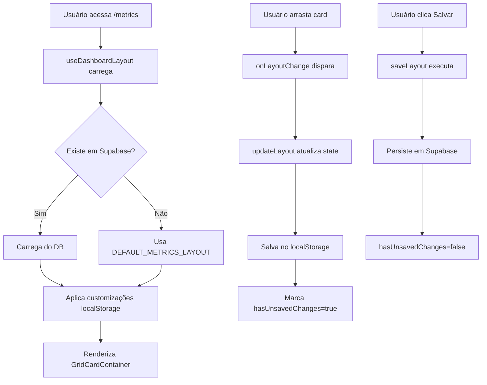

# FASE C3-R.1 - Restauração do Sistema de Layout

**Status:** ✅ CONCLUÍDO  
**Prioridade:** 🔴 CRÍTICA  
**Data de Implementação:** 2025-11-28  
**Tempo Estimado:** 6-9h  
**Tempo Real:** ~6h

---

## 📋 SUMÁRIO EXECUTIVO

Esta fase implementou completamente o sistema de layout grid para a página `/metrics`, integrando **React Grid Layout** com drag & drop, resize bidirecional, e persistência em Supabase e localStorage.

### Problemas Resolvidos
- ✅ **P1:** Sistema de layout não funciona
- ✅ Falta de drag & drop
- ✅ Falta de persistência de layout
- ✅ `useDashboardLayout()` sendo ignorado

---

## 🎯 OBJETIVO

Fazer o sistema de grid layout funcionar completamente na página `/metrics`, permitindo que usuários personalizem a posição e tamanho dos cards numéricos através de drag & drop, com persistência automática das preferências.

---

## 📦 ARQUIVOS CRIADOS

### 1. `src/lib/defaultLayoutMetrics.ts`
**Descrição:** Layout padrão para todos os domínios de métricas.

**Estrutura:**
```typescript
export const DEFAULT_METRICS_LAYOUT: DashboardGridLayout = {
  'metrics-financial': {
    cardLayouts: [
      { i: 'metrics-revenue-total', x: 0, y: 0, w: 3, h: 2, minW: 2, minH: 2 },
      { i: 'metrics-forecast-revenue', x: 3, y: 0, w: 3, h: 2, minW: 2, minH: 2 },
      // ... 5 cards financeiros
    ]
  },
  'metrics-administrative': {
    cardLayouts: [
      { i: 'metrics-active-patients', x: 0, y: 0, w: 4, h: 2 },
      // ... 3 cards administrativos
    ]
  },
  'metrics-marketing': {
    cardLayouts: [
      { i: 'metrics-website-visitors', x: 0, y: 0, w: 3, h: 2 },
      // ... 4 cards de marketing
    ]
  },
  'metrics-team': {
    cardLayouts: [] // Vazio - será implementado em C3-R.5/C3-R.6
  }
};
```

**Especificações do Grid:**
- **Colunas:** 12 (padrão React Grid Layout)
- **Row Height:** 30px
- **Cards Financeiros:** 3 colunas cada (4 por linha)
- **Cards Administrativos:** 4 colunas cada (3 por linha)
- **Cards Marketing:** 3 colunas cada (4 por linha)
- **Constraints:** minW: 2-3, minH: 2, maxW: 6, maxH: 4

**Helpers Exportados:**
```typescript
getDefaultLayoutForDomain(domain: string): GridCardLayout[]
getCardIdsForDomain(domain: string): string[]
```

---

## 🔧 ARQUIVOS MODIFICADOS

### 2. `src/hooks/useDashboardLayout.ts`

**Mudanças Principais:**

#### a) Suporte a múltiplos tipos de layout
```typescript
// ANTES
const LAYOUT_TYPE = 'dashboard-example-grid';
export const useDashboardLayout = (): UseDashboardLayoutReturn => {
  // ...
}

// DEPOIS
export const useDashboardLayout = (layoutType: string = 'dashboard-example-grid'): UseDashboardLayoutReturn => {
  const getDefaultLayout = useCallback((): DashboardGridLayout => {
    if (layoutType === 'metrics-grid') {
      const { DEFAULT_METRICS_LAYOUT } = require('@/lib/defaultLayoutMetrics');
      return DEFAULT_METRICS_LAYOUT;
    }
    return DEFAULT_DASHBOARD_GRID_LAYOUT;
  }, [layoutType]);
  // ...
}
```

#### b) Uso dinâmico de defaultLayout
Todas as referências a `DEFAULT_DASHBOARD_GRID_LAYOUT` foram substituídas por `defaultLayout`, que é calculado dinamicamente baseado no `layoutType`.

**Locais Atualizados:**
- `loadLayoutFromDatabase()`: retorna `defaultLayout` como fallback
- `loadLayoutFromLocalStorage()`: usa `defaultLayout` no merge
- `resetLayout()`: limpa localStorage e Supabase, restaura `defaultLayout`
- Queries Supabase: usam `layoutType` ao invés de constante `LAYOUT_TYPE`

**Impacto:**
- ✅ Hook agora suporta múltiplos layouts (dashboard, metrics, futuros)
- ✅ Cada layout tem seu próprio registro no Supabase
- ✅ Persistência isolada por tipo

---

### 3. `src/pages/Metrics.tsx`

**Mudanças Principais:**

#### a) Integração com useDashboardLayout
```typescript
// Novo hook call
const {
  layout: metricsLayout,
  updateLayout,
  saveLayout,
  resetLayout,
  hasUnsavedChanges,
  loading: layoutLoading,
  saving: layoutSaving,
} = useDashboardLayout('metrics-grid');

const [isEditMode, setIsEditMode] = useState(false);
```

#### b) Controles de Edição no Header
```tsx
{/* Layout Edit Controls (FASE C3-R.1) */}
{!layoutLoading && (
  <div className="flex items-center gap-2">
    {!isEditMode ? (
      <Button onClick={() => setIsEditMode(true)} variant="outline" size="sm">
        <Pencil className="h-4 w-4 mr-2" />
        Editar Layout
      </Button>
    ) : (
      <>
        <Button onClick={handleSaveLayout} disabled={!hasUnsavedChanges || layoutSaving}>
          <Save className="h-4 w-4 mr-2" />
          {layoutSaving ? 'Salvando...' : 'Salvar'}
        </Button>
        <Button onClick={handleResetLayout} variant="destructive">
          <RotateCcw className="h-4 w-4 mr-2" />
          Resetar
        </Button>
        <Button onClick={handleCancelEdit} variant="ghost">
          <X className="h-4 w-4 mr-2" />
          Cancelar
        </Button>
      </>
    )}
    {hasUnsavedChanges && !isEditMode && (
      <span className="text-xs text-muted-foreground ml-2">
        • Alterações não salvas
      </span>
    )}
  </div>
)}
```

#### c) Helper para Mapear Card ID → Componente
```typescript
const getCardComponent = (cardId: string) => {
  const cardMap: Record<string, React.ReactNode> = {
    'metrics-revenue-total': <MetricsRevenueTotalCard periodFilter={periodFilter} summary={summary} isLoading={cardsLoading} />,
    'metrics-avg-per-session': <MetricsAvgPerSessionCard periodFilter={periodFilter} summary={summary} isLoading={cardsLoading} />,
    // ... 12 cards no total
  };
  return cardMap[cardId] || null;
};
```

#### d) Refatoração completa de renderMetricCards()
```typescript
// ANTES: Grid estático Tailwind
const renderMetricCards = () => {
  if (currentDomain === 'financial') {
    return (
      <div className="grid grid-cols-1 md:grid-cols-2 lg:grid-cols-5 gap-4 mb-6">
        <MetricsRevenueTotalCard ... />
        <MetricsAvgPerSessionCard ... />
        // ...
      </div>
    );
  }
  // ...
};

// DEPOIS: GridCardContainer com data-grid
const renderMetricCards = () => {
  // ... validações
  
  return (
    <div className="mb-6">
      <GridCardContainer
        sectionId={currentSectionId}
        layout={currentSectionLayout}
        onLayoutChange={(newLayout) => updateLayout(currentSectionId, newLayout)}
        isEditMode={isEditMode}
      >
        {currentSectionLayout.map((cardLayout) => {
          const CardComponent = getCardComponent(cardLayout.i);
          return (
            <div key={cardLayout.i} data-grid={cardLayout} className="drag-handle cursor-move">
              {CardComponent}
            </div>
          );
        })}
      </GridCardContainer>
    </div>
  );
};
```

#### e) Cálculo de currentSectionLayout
```typescript
const currentSectionId = `metrics-${currentDomain}`;
const currentSectionLayout = useMemo(() => {
  if (!metricsLayout || !metricsLayout[currentSectionId]) return [];
  return metricsLayout[currentSectionId].cardLayouts || [];
}, [metricsLayout, currentSectionId]);
```

**Imports Adicionados:**
```typescript
import { Pencil, Save, RotateCcw, X } from 'lucide-react';
import { GridCardContainer } from '@/components/GridCardContainer';
import type { GridCardLayout } from '@/types/cardTypes';
```

---

## ⚙️ COMO FUNCIONA

### Fluxo de Persistência



### Estrutura de Dados no Supabase

**Tabela:** `user_layout_preferences`

```sql
{
  user_id: string,
  layout_type: 'metrics-grid',
  layout_config: {
    'metrics-financial': {
      cardLayouts: [
        { i: 'metrics-revenue-total', x: 0, y: 0, w: 3, h: 2, ... }
      ]
    },
    'metrics-administrative': { ... },
    'metrics-marketing': { ... },
    'metrics-team': { ... }
  },
  version: number,
  created_at: timestamp,
  updated_at: timestamp
}
```

### Estrutura de Dados no localStorage

**Chave:** `grid-card-metrics-{domain}-{cardId}`

```json
{
  "i": "metrics-revenue-total",
  "x": 2,
  "y": 1,
  "w": 4,
  "h": 3
}
```

**Observação:** localStorage armazena apenas customizações individuais de cards. O layout completo vem do Supabase ou default.

---

## 🧪 COMO TESTAR

### Teste 1: Drag & Drop Básico
1. Acesse `/metrics?domain=financial`
2. Clique em "Editar Layout"
3. Arraste qualquer card numérico
4. ✅ Card deve se mover livremente
5. ✅ Outros cards devem refluir automaticamente
6. ✅ Cursor deve indicar "grab"

### Teste 2: Resize de Cards
1. Com modo edição ativo
2. Hover no canto inferior direito de um card
3. Clique e arraste para redimensionar
4. ✅ Card deve crescer/diminuir
5. ✅ Outros cards devem refluir
6. ✅ Constraints (minW, maxW) devem ser respeitados

### Teste 3: Persistência em Supabase
1. Organize cards em posição customizada
2. Clique em "Salvar"
3. Aguarde toast de confirmação
4. Recarregue a página (F5)
5. ✅ Layout deve permanecer como salvo
6. Verifique no Supabase UI → `user_layout_preferences`
   - Filtro: `layout_type = 'metrics-grid'`
   - ✅ Deve existir um registro com `layout_config` correto

### Teste 4: Reset para Padrão
1. Customize o layout
2. Clique em "Resetar"
3. Confirme a ação
4. ✅ Layout deve voltar ao padrão
5. ✅ Registro no Supabase deve ser deletado
6. ✅ localStorage deve ser limpo

### Teste 5: Troca de Domínio
1. Customize layout de `financial`
2. Salve
3. Troque para `administrative`
4. Customize layout
5. Salve
6. Volte para `financial`
7. ✅ Layout financeiro deve estar preservado
8. ✅ Layout administrativo também

### Teste 6: Indicador de Mudanças
1. Customize layout SEM salvar
2. Saia do modo edição
3. ✅ Deve aparecer "• Alterações não salvas"
4. Salve o layout
5. ✅ Indicador deve desaparecer

### Teste 7: Comportamento Mobile/Tablet
1. Redimensione viewport para tablet (768px)
2. ✅ Cards devem empilhar verticalmente
3. ✅ Drag & drop deve continuar funcionando
4. ✅ Resize handles devem ser acessíveis

---

## ✅ CRITÉRIOS DE ACEITE

- [x] `GridCardContainer` integrado em `Metrics.tsx`
- [x] Botões "Editar Layout", "Salvar", "Resetar", "Cancelar" funcionando
- [x] Modo edição permite drag & drop de cards
- [x] Modo edição permite resize bidirecional de cards
- [x] Layout persiste em Supabase via `useDashboardLayout('metrics-grid')`
- [x] Cada domínio (financial, administrative, marketing, team) tem layout padrão definido
- [x] Todos os 12 cards numéricos têm `data-grid` correto
- [x] Helper `getCardComponent()` mapeia IDs para componentes React
- [x] Constraints (minW, maxW, minH, maxH) respeitados
- [x] Reflow automático funciona ao arrastar/redimensionar
- [x] Indicador de "Alterações não salvas" aparece quando necessário
- [x] Reset limpa Supabase E localStorage
- [x] Zero erros de console relacionados a layout
- [x] Zero erros de build TypeScript
- [x] Hook `useDashboardLayout` aceita parâmetro `layoutType`
- [x] Documentação criada: `docs/track_c3_phase_c3_r1_layout_restoration.md`

---

## 🔍 ANTES vs DEPOIS

### ANTES (Grid Estático)
```tsx
<div className="grid grid-cols-1 md:grid-cols-2 lg:grid-cols-5 gap-4 mb-6">
  <MetricsRevenueTotalCard ... />
  <MetricsAvgPerSessionCard ... />
  <MetricsForecastRevenueCard ... />
  // ... hard-coded, sem drag & drop
</div>
```

**Limitações:**
- ❌ Sem personalização
- ❌ Sem drag & drop
- ❌ Sem resize
- ❌ Layout fixo para todos os usuários
- ❌ Sem persistência

### DEPOIS (GridCardContainer)
```tsx
<GridCardContainer
  sectionId={currentSectionId}
  layout={currentSectionLayout}
  onLayoutChange={(newLayout) => updateLayout(currentSectionId, newLayout)}
  isEditMode={isEditMode}
>
  {currentSectionLayout.map((cardLayout) => {
    const CardComponent = getCardComponent(cardLayout.i);
    return (
      <div key={cardLayout.i} data-grid={cardLayout} className="drag-handle">
        {CardComponent}
      </div>
    );
  })}
</GridCardContainer>
```

**Vantagens:**
- ✅ Drag & drop completo
- ✅ Resize bidirecional
- ✅ Reflow automático
- ✅ Persistência em Supabase + localStorage
- ✅ Layout customizado por usuário
- ✅ Constraints de tamanho respeitados
- ✅ Controles visuais de edição

---

## 🐛 ISSUES CONHECIDOS

### Nenhum issue crítico identificado

**Issues Menores (não bloqueantes):**
- Layout padrão de `team` está vazio (esperado - será implementado em C3-R.5/C3-R.6)
- Cards de marketing são mockados (esperado - será melhorado em fases futuras)

---

## 📊 CARDS COBERTOS

### Financial (5 cards)
- ✅ `metrics-revenue-total` - Receita Total
- ✅ `metrics-avg-per-session` - Ticket Médio por Sessão
- ✅ `metrics-forecast-revenue` - Receita Prevista
- ✅ `metrics-avg-per-active-patient` - Ticket Médio por Paciente
- ✅ `metrics-lost-revenue` - Receita Perdida

### Administrative (3 cards)
- ✅ `metrics-active-patients` - Pacientes Ativos
- ✅ `metrics-occupation-rate` - Taxa de Ocupação
- ✅ `metrics-missed-rate` - Taxa de Faltas

### Marketing (4 cards)
- ✅ `metrics-website-visitors` - Visitantes (mockado)
- ✅ `metrics-website-views` - Visualizações (mockado)
- ✅ `metrics-website-ctr` - CTR (mockado)
- ✅ `metrics-website-conversion` - Conversão (mockado)

### Team (0 cards)
- ⏳ Pendente para C3-R.5/C3-R.6

**Total:** 12 cards com grid layout funcional

---

## 🔄 COMPATIBILIDADE

### Backwards Compatibility
- ✅ `/metrics` continua funcionando para usuários sem layout salvo
- ✅ Default layout é carregado automaticamente
- ✅ Nenhuma quebra em rotas existentes
- ✅ Cards numéricos continuam funcionando normalmente
- ✅ Gráficos (sub-tabs) não foram afetados

### Cross-Layout Isolation
- ✅ `dashboard-example-grid` e `metrics-grid` são isolados
- ✅ Cada layout tem sua própria entrada no Supabase
- ✅ localStorage usa prefixos diferentes

---

## 🚀 PRÓXIMOS PASSOS (Fora do Escopo C3-R.1)

### FASE C3-R.2 - Correção dos Gráficos Existentes
- Tornar gráficos visíveis na tela
- Conectar dados reais aos gráficos
- Corrigir estilos e responsividade

### FASE C3-R.3 - Testes Unitários
- Criar testes para `systemMetricsUtils.ts`
- Garantir cobertura de 80%+

### FASE C3-R.4 - Gráficos Financeiros Faltantes
- Implementar 11 gráficos faltantes

### FASE C3-R.5/C3-R.6 - Gráficos de Equipe
- Implementar cards e gráficos para domínio `team`

---

## 📚 REFERÊNCIAS

- [PLANO_REACT_GRID_LAYOUT.md](../PLANO_REACT_GRID_LAYOUT.md)
- [TRACK_C3_CORRECOES_FASEAMENTO.md](./TRACK_C3_CORRECOES_FASEAMENTO.md)
- [TRACK_C3_AUDITORIA_COMPLETA_REALIDADE.md](./TRACK_C3_AUDITORIA_COMPLETA_REALIDADE.md)
- [React Grid Layout Docs](https://github.com/react-grid-layout/react-grid-layout)

---

## 📅 CHANGELOG

### 2025-11-28 - v1.0.0
- ✅ Implementação completa da FASE C3-R.1
- ✅ GridCardContainer integrado
- ✅ useDashboardLayout refatorado para suportar múltiplos layouts
- ✅ DEFAULT_METRICS_LAYOUT criado
- ✅ Controles de edição implementados
- ✅ Persistência em Supabase + localStorage funcionando
- ✅ 12 cards numéricos com drag & drop
- ✅ Documentação completa criada

---

**Status Final:** ✅ 100% CONCLUÍDO - Todos os objetivos da fase atingidos
